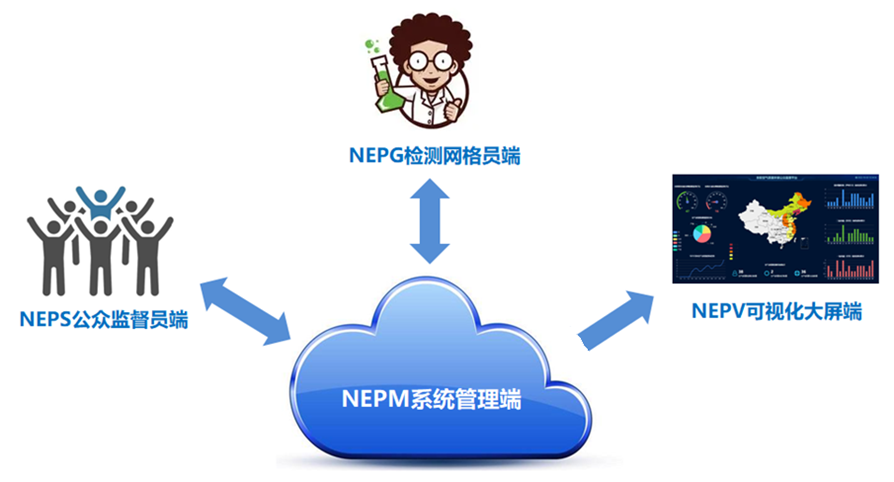
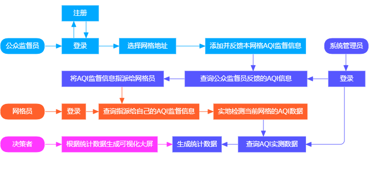
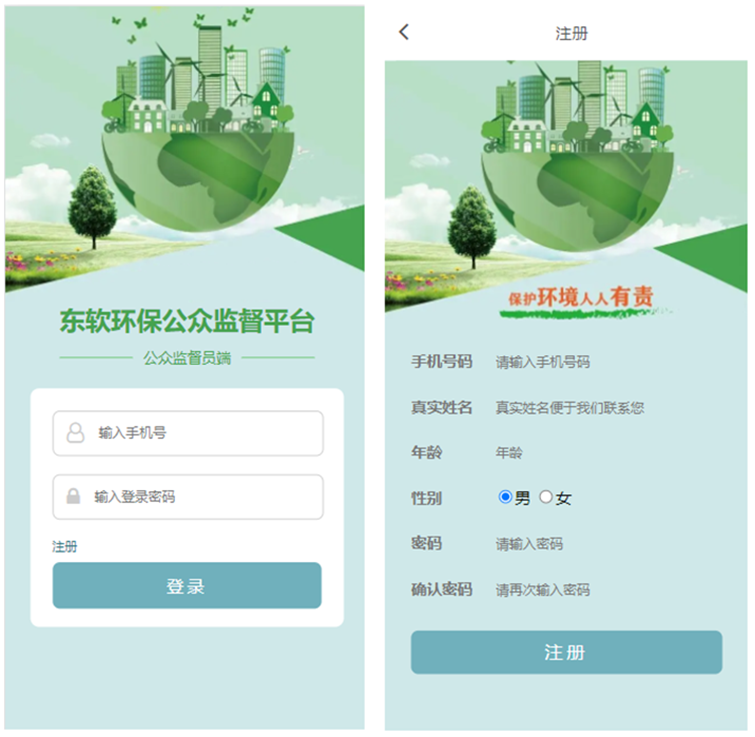
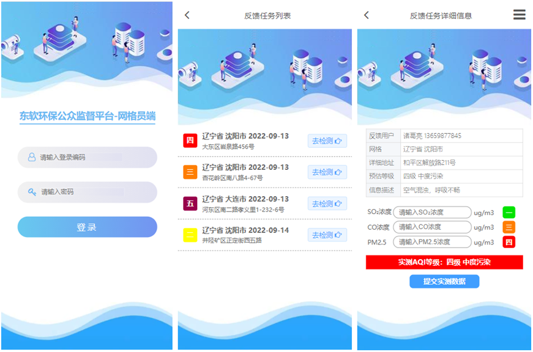
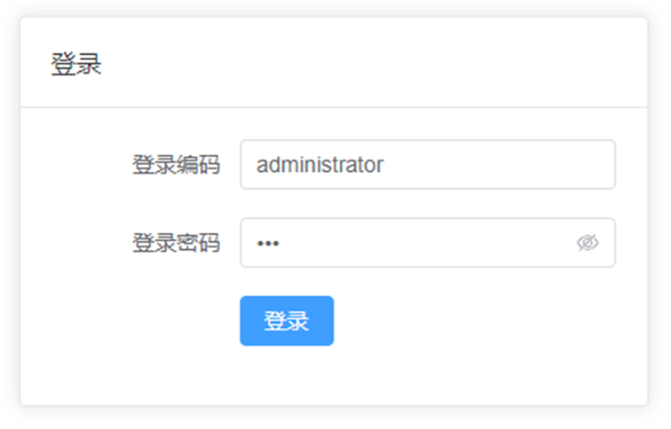
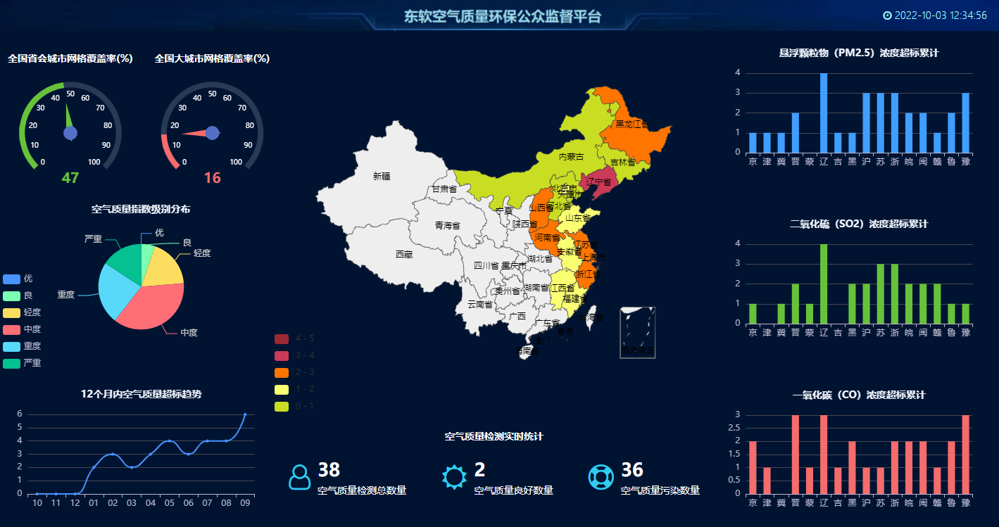
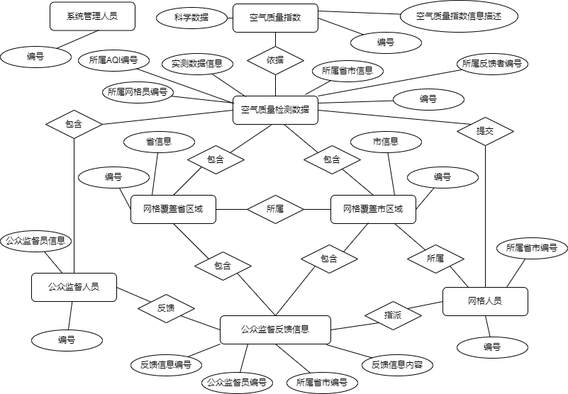

# 东软环保公众监督系统（Neusoft Environmental Public Supervision System）

一个覆盖**公众 AQI 反馈、网格员检测、管理员审核、数据可视化大屏**的全栈环保监督系统。

## 技术栈

- **后端**：Java、Spring Boot 3.4.9、MyBatis、MySQL 8、PageHelper、Hutool
- **前端**：Vue 3.5（Composition API）、Element Plus、Vue Router、Vuex、Axios、ECharts、@wangeditor

## 目录结构

```
nep-system/
├── backend/    # Spring Boot 后端（端口 9090）
├── frontend/   # Vue 3 前端（端口 8080，代理到 9090）
└── sql/        # 数据库脚本（表结构 + 测试数据）
```

## 功能模块

| 角色 | 功能 |
|------|------|
| 公众监督员 | 注册登录、提交 AQI 反馈（省/市/地址/照片）、历史反馈查询 |
| 网格员 | 登录、按省/市查询检测任务 |
| 管理员 | 审核反馈、查看统计报表 |
| 决策者 | 登录、数据可视化大屏（AQI 分布、趋势、省市覆盖） |

## 访问地址

### 前端（8080 端口）

基础地址：`http://localhost:8080`

**登录/注册页面：**

| 页面 | 地址 | 测试账号 |
|------|------|----------|
| 网格员登录（默认跳转） | `http://localhost:8080/gridMemberLogin` | `gm001` / `gm123` |
| 管理员登录 | `http://localhost:8080/adminsLogin` | `admin01` / `Admin@123` |
| 公众监督员登录 | `http://localhost:8080/supervisorLogin` | `13800001111` / `sup123` |
| 公众监督员注册 | `http://localhost:8080/supervisorRegister` | （自行注册） |
| 决策员登录 | `http://localhost:8080/decisionMakerLogin` | `dm001` / `dm123` |

**角色页面（登录后）：**

| 角色 | 页面 | 地址 |
|------|------|------|
| 管理员 | 公众监督数据列表 | `http://localhost:8080/admins/publicSupervise` |
| 管理员 | 确认AQI数据列表 | `http://localhost:8080/admins/aqiConfirm` |
| 管理员 | 省分组检查统计 | `http://localhost:8080/admins/provinceStat` |
| 管理员 | AQI指数分布统计 | `http://localhost:8080/admins/aqiDist` |
| 管理员 | AQI指数趋势统计 | `http://localhost:8080/admins/aqiTrend` |
| 管理员 | 其它数据统计 | `http://localhost:8080/admins/otherStat` |
| 网格员 | 反馈任务列表 | `http://localhost:8080/gridMember/feedbackTask` |
| 公众监督员 | 提交反馈 | `http://localhost:8080/supervisor/feedback` |
| 公众监督员 | 历史反馈信息 | `http://localhost:8080/supervisor/feedbackHistory` |
| 决策员 | 数据可视化大屏 | `http://localhost:8080/decisionMaker/visionData`（或 `/visionData`） |

### 后端（9090 端口）

基础地址：`http://localhost:9090`

**登录认证：**
- `POST /adminsLogin`、`/gridMemberLogin`、`/supervisorLogin`、`/decisionMakerLogin` — 各角色登录
- `POST /supervisorRegister` — 公众监督员注册
- `PUT /updatePassword` — 修改密码

**反馈（`/aqiFeedback`）：**
- `POST /saveAqiFeedback` — 提交AQI反馈
- `GET /listAqiFeedbackByTelId`、`listAqiFeedbackAll`、`listAqiFeedbackPage` — 反馈查询
- `GET /getAqiFeedbackById` — 反馈详情
- `PUT /updateAqiFeedbackAssign`、`updateAqiFeedbackState` — 分配/审核反馈

**统计（`/statistics`）：**
- `GET /listStatisticsPage` — 分页统计
- `GET /listAqiDistributeTotalStatis`、`listAqiTrendTotalStatis`、`listProvinceItemTotalStatis` — 图表数据
- `GET /getAqiCount`、`getAqiGoodCount`、`getProvinceCoverage`、`getCityCoverage` — 数量与覆盖率
- `POST /saveStatistics` — 保存统计

**其他：**
- `GET /admins/getAdminsByCode`
- `GET /gridMember/listGridMemberByProvinceIdByCityId`
- `GET /gridCity/getProvinceAndCity`
- `GET /aqi/listAqiAll`
- `POST /files/upload`、`GET /files/download/{fileName}`
- `GET /hello` — 健康检查

## 效果图

| 系统架构 | 业务流程图 |
|:---:|:---:|
|  |  |

| 公众监督员端（提交反馈） | 网格员端（任务列表） |
|:---:|:---:|
|  |  |

| 管理员端 | 决策者可视化大屏 |
|:---:|:---:|
|  |  |



## 快速启动

1. **数据库**：MySQL 8 中创建数据库 `nep`，依次执行 `sql/` 下的脚本（数据库账号配置见 `backend/src/main/resources/application.yml`）
2. **后端**：IDEA 打开 `backend/`，运行主类，端口 **9090**
3. **前端**：VS Code 打开 `frontend/`，执行 `npm install` 后 `npm run serve`，访问 http://localhost:8080

## 测试账号

**管理员**（登录编码 / 密码）：`admin01` / `Admin@123`，更多账号（`admin01`–`admin05`、`dataMgmt`、`audit01`、`report01`、`super01` 等）见 `sql/admins_test_data.sql`

**网格员**（编码 / 密码）：`gm001`–`gm006`，密码均为 `gm123`，见 `sql/补全数据.sql`

**公众监督员**（手机号 / 密码）：`13800001111`–`13800008888`，密码均为 `sup123`，见 `sql/补全数据.sql`

**决策员**（用户名 / 密码）：`dm001` / `dm123`、`dm002` / `dm123`、`dm003` / `dm123`，见 `sql/test_data.sql`
